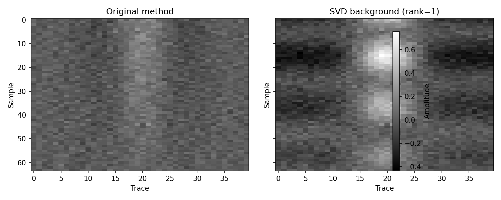

# 探地雷达组会汇报
## 方法-结果-结论（极简版）
- 目标：少字大图，只保留可决策信息
- 数据：同一批 B-scan 对比
> 截图来源：reports/screenshots/*.png、reports/compare_*.png
---
# 方法（Method）
- 流程：去背景 → 增益（SEC/AGC）→ 滤波/成像
- 对比原则：同色标、同量程、同窗长

> 图注：标准处理链路（用于解释结果来源）
---
# 结果1：背景抑制
- SVD 背景抑制后，水平条纹显著下降
- 弱目标边缘更清晰

> 图注：左基线 / 右改进（同幅值范围）
---
# 结果2：增益与滤波
- AGC 提升深层可见性
- F-K/Hankel 使事件连续性更好

> 图注：上图基线AGC，下图改进SEC（均为同数据段）
---
# 结论（Conclusion）
- 方法有效：可见性↑、条纹噪声↓、可解释性↑
- 当前最稳组合：SVD 去背景 + 适度增益 + 频域抑噪
- 下一步：固定参数模板，做多场景复现与定量指标（SNR/对比度）
> 一句话：先“看清楚”，再“量准确”。